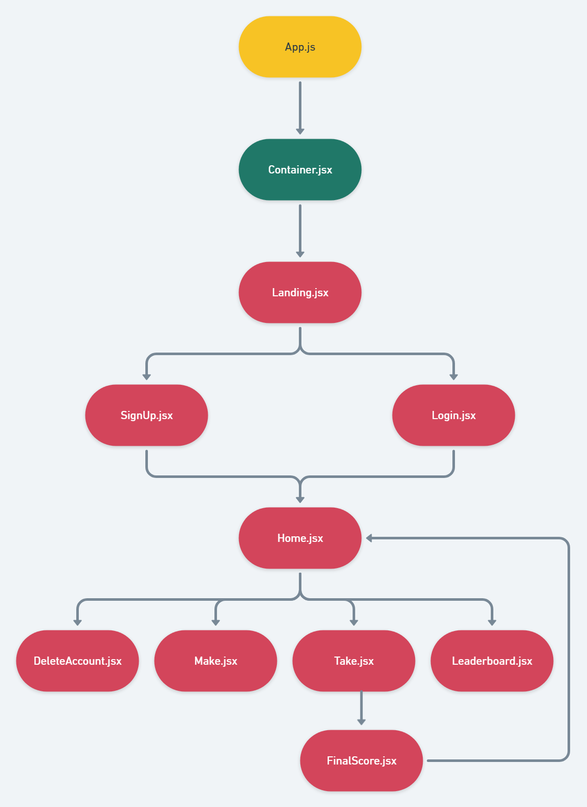
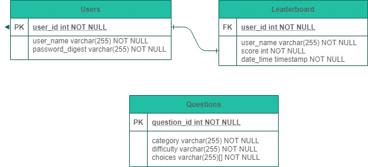

# PROJECT 4 README <!-- omit in toc -->

- [Overview](#overview)
- [Features](#features)
- [MVP](#mvp)
  - [Goals](#goals)
  - [Challenges](#challenges)
  - [Libraries and Dependencies](#libraries-and-dependencies)
  - [Client (Front End)](#client-front-end)
    - [Wireframes](#wireframes)
    - [Component Tree](#component-tree)
    - [Component Hierarchy](#component-hierarchy)
    - [Component Breakdown](#component-breakdown)
    - [Time Estimates](#time-estimates)
  - [Server (Back End)](#server-back-end)
    - [ERD Model](#erd-model)
    - [API Documentation](#api-documentation)
- [Post-MVP](#post-mvp)
- [Code Showcase](#code-showcase)
- [Code Issues & Resolutions](#code-issues--resolutions)

<br>

## Overview

_**Trivia** is a project that grabs ten trivia questions from the open trivia database and keeps track of scores in a leaderboard. You have to log in to play the game, and those logins will be stored in a table that is linked to high scores._

<br>

## Features

- _A trivia app capable of getting random questions from the Open Trivia Database API._
- _An ability to save high scores to a leaderboard._
- _Full CRUD capability for user accounts and individual leaderboard scores._
- _Top five scores are shown on the home page with user, score, and date posted._

<br>

## MVP

_The **Trivia** MVP will contain three tables: users, trivia questions, and high scores. The application will use a front-end to shape the GUI and a back-end to store the data. Trivia games will be twenty questions, each worth 200 points, for a maximum score of 4,000 points. A leaderboard will be implemented to save high scores, the users that achieved them, and the date and time that the scores were posted. Users will be able to remove their scores from the leaderboards and also remove their account._

<br>

### Goals

- _A landing page that requires users to sign up before playing a game of trivia._
- _After logging in, a home page that lets you start a round of trivia._
- _The trivia game consists of twenty questions that get cycled through, while a running score keeps track of questions answered correctly._
- _A separate leaderboard component that shows high scores earned._
- _Full CRUD funcionality for leaderboard scores and user accounts._

<br>

### Challenges

- _The biggest challenge will be to unite the front and the back end. I am capable on working on each individually, but combining them may prove challengings._
- _Making sure that the leaderboard is constantly updated and that users can only delete their own scores without interfering with anyone else's._
- _I'm a little rusty about including API's in the project, so a refresher will be needed to make sure that works properly._

<br>

### Libraries and Dependencies

|     Library      | Description                                |
| :--------------: | :----------------------------------------- |
|       API        | _https://opentdb.com/api_config.php_ |
|      React       | _Will be used to develop the GUI on the front end._ |
|   React Router   | _Will contain trivia game components like multiple choice answers and questions._ |
|     Express      | _Tables will be created for users, questions, and the leaderboard._ |
|  Express Router  | _Each table component above will be called upon on their appropriate pages._ |

<br>

### Client (Front End)

#### Wireframes


- Desktop Landing


- Desktop Hero


- Resource Index


- Resource Show


- Tablet Resource Index


- Mobile Resource Index

#### Component Hierarchy

``` structure

src
|__ assets/
      |__ fonts
      |__ graphics
      |__ images
      |__ mockups
|__ components/
      |__ Header.jsx
      |__ Body.jsx
      |__ Leaderboard.jsx
      |__ Question.jsx
      |__ Final_Score.jsx
      |__ User_Create.jsx
      |__ User_Delete.jsx
|__ services/

```

#### Component Tree



**Breakdown**

- The app starts on the landing page, where a user can either sign up or log in with an existing account.
- The next destination is the home page, where the current leaderboard can be viewed or a user can start a new game.
- The game component will post random questions from the API with multiple choices for the answer.
- The final score page is reached after twenty questions have been answered, showing the number of correct answers and the total score.
- From that score page, the user can submit their score to the leaderboard and return to the home page.

#### Time Estimates

| Task                | Priority | Estimated Time | Actual Time |
| ------------------- | :------: | :------------: | :-----------: |
| Create User Database    |    H     |     3 hrs      |     TBD     |
| Create Sign Up/Log In Pages |    H     |     4 hrs      |     TBD     |
| Create Landing Page |    H     |     4 hrs      |     TBD     |
| Create Leaderboard Table |    H     |     5 hrs      |     TBD     |
| Implement Top Five Leaderboard Scores on Home Page |    M     |     4 hrs      |     TBD     |
| Call Upon the Trivia API to post a random question |    H     |     5 hrs      |     TBD     |
| Make a game that uses twenty questions |    H     |     6 hrs      |     TBD     |
| Implement scoring system |    M     |     3 hrs      |    TBD    |
| Allow CRUD for leaderboards and user accounts |    H     |     5 hrs      |    TBD    |
| Post-MVP: Customize difficulty |    L     |     4 hrs      |    TBD    |
| Post-MVP: Make score proportional to question difficulty |    L     |     4 hrs      |    TBD    |
| Post-MVP: Allow users to select category of questions |    L     |     5 hrs      |    TBD    |
| TOTAL               |    H     |     55 hrs      |     TBD     |

<br>

### Server (Back End)

<br>

#### ERD Model



<br>

#### API Documentation

[Open Trivia Database API](https://opentdb.com/api_config.php)

<br>

***

## Post-MVP

- _Customize difficulty by allowing the user to pick more difficult questions for a higher score potential._
- _Base the score on how difficult the questions are, the harder the question the higher the points that can be scored._
- _Allow users to select the category of trivia they desire._

***

## Code Showcase

To be included at a later point.

## Code Issues & Resolutions

To be included at a later point.
