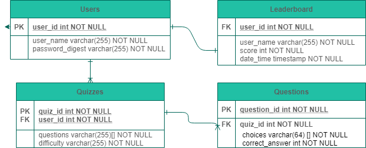

# TRIVIA (GA Project 4) README <!-- omit in toc -->

- [Overview](#overview)
- [Features](#features)
- [MVP](#mvp)
  - [Goals](#goals)
  - [Challenges](#challenges)
  - [Libraries and Dependencies](#libraries-and-dependencies)
  - [Client (Front End)](#client-front-end)
    - [Wireframes](#wireframes)
    - [Component Tree](#component-tree)
    - [Component Hierarchy](#component-hierarchy)
    - [Component Breakdown](#component-breakdown)
    - [Time Estimates](#time-estimates)
  - [Server (Back End)](#server-back-end)
    - [ERD Model](#erd-model)
- [Post-MVP](#post-mvp)
- [Code Showcase](#code-showcase)
- [Code Issues & Resolutions](#code-issues--resolutions)

<br>

## Overview

_**Trivia** is a project that allows users to both MAKE and TAKE quizzes, while keeping track of scores in a leaderboard. You have to log in to make or take quizzes, and those logins will be stored in a table that is linked to quizzes created and leaderboard scores._

[Live Website](https://mernin-trivia.netlify.app)

<br>

## Features

- _A trivia app capable of allowing users to make quizzes and to take quizzes already made._
- _An ability to save high scores to a leaderboard._
- _Full CRUD capability for user accounts, individual leaderboard scores, and user-generated quizzes._
- _Top five scores are shown on the home page with user, score, and date posted._

<br>

## MVP

_The **Trivia** MVP will contain three tables: users, quizzes, and leaderboard. The application will use a front-end to shape the GUI and a back-end to store the data. Trivia games will be ten questions, each worth 200 points, for a maximum score of 4,000 points. A leaderboard will be implemented to save high scores, the users that achieved them, and the date and time that the scores were posted. Users will be able to remove their scores from the leaderboards and also remove their account._

<br>

### Goals

- _A landing page that requires users to sign up before playing a game of trivia._
- _After logging in, a home page that lets you take a quiz or make your own._
- _Each quiz consists of ten questions that get cycled through, while a running score keeps track of questions answered correctly and points earned._
- _A separate leaderboard component that shows all high scores earned._
- _Full CRUD funcionality for leaderboard scores, user quizzes, and user accounts._

<br>

### Challenges

- _The biggest challenge will be to unite the front and the back end. I am capable on working on each individually, but combining them may prove challenging._
- _Making sure that the leaderboard is constantly updated and that users can only delete their own scores without interfering with anyone else's._
- _I'm a little rusty about including API's in the project, so a refresher will be needed to make sure that works properly._

<br>

### Libraries and Dependencies

|     Library      | Description                                |
| :--------------: | :----------------------------------------- |
|      React       | _Will be used to develop the GUI on the front end._ |
|   React Router   | _Will contain trivia game components like multiple choice answers and questions._ |
|     Express      | _Tables will be created for users, questions, and the leaderboard._ |
|  Express Router  | _Each table component above will be called upon on their appropriate pages._ |

<br>

### Client (Front End)

#### Wireframes

[All Wireframes](https://whimsical.com/trivia-qxE6HCNk8nQ3XYJSB6YwB)

<br>

#### Component Hierarchy

``` structure

src
|__ assets/
      |__ fonts
      |__ graphics
      |__ images
      |__ mockups
|__ components/
      |__ Question
            |__ Question.css
            |__ Question.js
      |__ QuestionDisplay
            |__ QuestionDisplay.css
            |__ QuestionDisplay.js
      |__QuestionCreate
            |__QuestionCreate.css
            |__QuestionCreate.js
      |__ Answer
            |__ Answer.css
            |__ Answer.js
      |__ FinalScore
            |__ FinalScore.css
            |__ FinalScore.js
      |__ shared/
            |__ Header/
                  |__ Header.css
                  |__ Header.js
            |__ Layout/
                  |__ Layout.css
                  |__ Layout.js
            |__ Footer/
                  |__ Footer.css
                  |__ Footer.js
|__ screens
      |__ Landing
            |__ Landing.css
            |__ Landing.js
      |__ Home
            |__ Home.css
            |__ Home.js
      |__ Leaderboard
            |__ Leaderboard.css
            |__ Leaderboard.js
      |__ UserAccount
            |__ UserAccount.css
            |__ UserAccount.js
      |__ UserQuizzes
            |__ UserQuizzes.css
            |__UserQuizzes.js
|__ services/
      |__ apiConfig.js
      |__ questions.js
      |__ App.css
      |__ App.js
      |__ index.css
      |__ index.js

```

<br>

#### Component Tree


**Breakdown**

- The app starts on the landing page, where a user can either sign up or log in with an existing account.
- The next destination is the home page, where the current leaderboard can be viewed or a user can start a new game.
- The game component will post random questions from the API with multiple choices for the answer.
- The final score page is reached after twenty questions have been answered, showing the number of correct answers and the total score.
- From that score page, the user can submit their score to the leaderboard and return to the home page.

<br>

#### Time Estimates

| Task                | Priority | Estimated Time | Actual Time |
| ------------------- | :------: | :------------: | :-----------: |
| Create User Database    |    H     |     3 hrs      |     3hrs     |
| Create Sign Up/Log In Pages |    H     |     4 hrs      |     4hrs     |
| Create Landing Page |    H     |     4 hrs      |     4hrs     |
| Create Leaderboard Table |    H     |     5 hrs      |     0hrs     |
| Implement Top Five Leaderboard Scores on Home Page |    M     |     4 hrs      |     0hrs     |
| Create a way for users to make their own quizzes |    H     |     8 hrs      |     8hrs     |
| Make a game that uses ten questions |    H     |     6 hrs      |     6hrs     |
| Implement scoring system |    M     |     3 hrs      |    0hrs    |
| Allow CRUD for leaderboards, user quizzes, and user accounts |    H     |     8 hrs      |    8hrs    |
| Post-MVP: Allow users to select category of questions |    L     |     5 hrs      |    0hrs    |
| TOTAL               |    H     |     50hrs      |     33hrs     |

<br>

### Server (Back End)

#### ERD Model



<br>

***

## Post-MVP

- _Customize difficulty by allowing the user to pick more difficult questions for a higher score potential._
- _Base the score on how difficult the questions are, the harder the question the higher the points that can be scored._
- _Allow users to select the category of trivia they desire._

***

<br>

## Code Showcase

The coolest part of the code was the complicated implementation of the answers.

```
{formData.map((answer, index) => (
  <div key={index}>
    <label>Answer {index + 1}
    <input
      type='text'
      data-index={index}
      value={answer.answer}
      onChange={handleChange}
    />
    </label>
    <label><input type='radio' data-index={index} checked={answer.isCorrect} onChange={handleRadioChange} />Correct</label>
  </div>
))}
```

<br>

## Code Issues & Resolutions

My project is very ambitious, so there are still some features that remain to be added, like taking the quiz and making a leaderboard.
